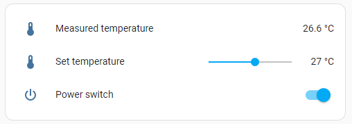
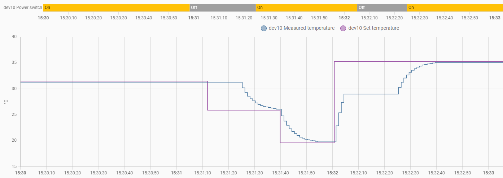
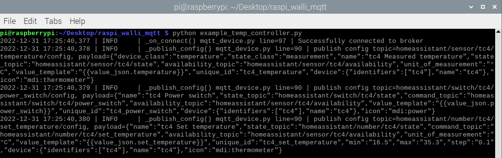

This mini example application `temp_controller` demontrates the usage of `MqttDevice`.

# MqttDevice
The [__MqttDevice__](mqtt_device.py) uses the [__Eclipse Paho MQTT Python client library__](https://pypi.org/project/paho-mqtt/) to implement a python client that runs on a __raspberry pi__ and supports [__Home Assistant MQTT Discovery__](https://www.home-assistant.io/integrations/mqtt/#mqtt-discovery). It is inspired by [RPI System sensors](https://github.com/Sennevds/system_sensors).

The number and type of MQTT entities is configurable with a `entities.yaml` file. The following entity types are supported:
- [__`sensor`__](https://developers.home-assistant.io/docs/core/entity/sensor/) such as a temperature measurement. The data flow is exclusively from the MQTT device to the MQTT broker through the state topic.
- [__`number`__](https://developers.home-assistant.io/docs/core/entity/number/) such as a set_temperature. The data flow is broker to client through the command topic. Then the client confirms through the state topic, as for the sensor type.
- [__`switch`__](https://developers.home-assistant.io/docs/core/entity/switch) such as a power switch. The data flow is identical to the number type, but with boolean content.

# Simple example application _Temperature controller_
The [example_temp_controller.py](example_temp_controller.py) (together with the [entities_temp_controller.yaml](entities_temp_controller.yaml)) is a simple temperature controller application using one entity of each available type. Once started and discovered by Home Assistant, it looks like this:



The simulated temperature controller is implemented with the following code block:
```Python
while True:
    stat = device.get_states()
    if stat["power_switch"] == "ON":
        delta = stat["set_temperature"] - stat["temperature"]
        new_temperature = round(stat["temperature"] + delta * FOLLOW_RATE, 1)
        device.set_states({"temperature": new_temperature})
        device.publish_updates()
```
The (measured) ``temperature`` follows the ``set_temperature`` with a certain `FOLLOW_RATE`.

The graph below shows the temperature controller in action. Note that the `measured temperature` only follows if the `power_switch` is `ON`.



## Publish config
The MQTT config message is published automatically after instanciating the `MqttDevice` class. 
`MqttDevice.__init__()` upon connect -> `_publish_config()`
Debug logging below shows the config messages:

