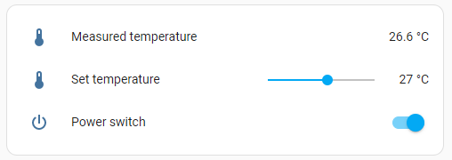
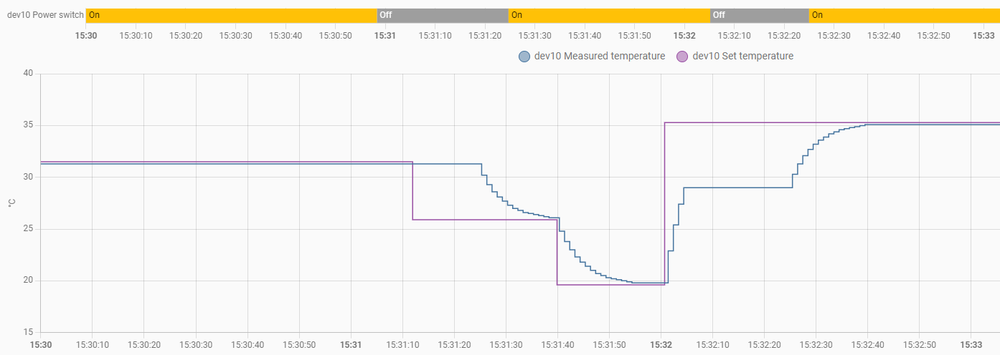
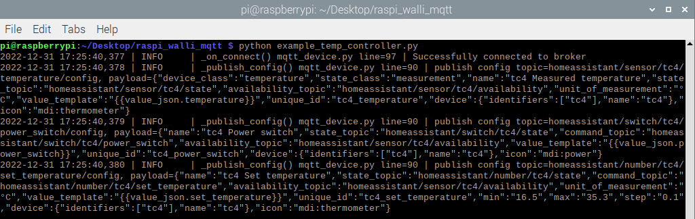

Raspberry pi serves connects a Heidelberger wallbox via Modbus and MQTT to home assistant

# MqttDevice
The [__MqttDevice__](mqtt_device.py) uses the [__Eclipse Paho MQTT Python client library__](https://pypi.org/project/paho-mqtt/) to implement a python client that runs on a __raspberry pi__ and supports [__Home Assistant MQTT Discovery__](https://www.home-assistant.io/integrations/mqtt/#mqtt-discovery).

The number and type of MQTT entities is configurable with a `entities.yaml` file. The following entity types are supported:
- [__`sensor`__](https://developers.home-assistant.io/docs/core/entity/sensor/) such as a temperature measurement. The data flow is exclusively from the MQTT device to the MQTT broker through the state topic.
- [__`number`__](https://developers.home-assistant.io/docs/core/entity/number/) such as a set_temperature. The data flow is broker to client through the command topic. Then the client confirms through the state topic, as for the sensor type.
- [__`switch`__](https://developers.home-assistant.io/docs/core/entity/switch) such as a power switch. The data flow is identical to the number type, but with boolean content.

## Simple example application _Temperature controller_
The [example_temp_controller.py](example_temp_controller.py) (together with the [entities_temp_controller.yaml](entities_temp_controller.yaml)) is a simple temperature controller application using one entity of each available type. Once started and discoverey by Home Assistant, it looks like this:

