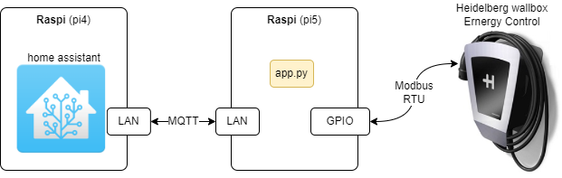

# Abstract
A __Raspberry pi__ connects a __Heidelberger wallbox__ via Modbus and MQTT to __home assistant__.

The poject consists of 3 building blocks:
1. A __MqttDevice__ implementation
2. A __Wallbox modbus interface__
3. An __application `app.py`__ connecting the two

# MqttDevice
The __`MqttDevice`__ is implemented in __[mqtt_device.py](mqtt_device.py)__ and demonstrated in a simple __[temperature-controller example](MqttDevice_simple_example/temp_controller.md)__.

# Wallbox modbus interface
The __Wallbox modbus interface__ is implemented in __[wallbox.py](wallbox.py)__, which is reused from the __[Raspi_walli project](https://github.com/munich-ml/raspi_walli)__.

# `app.py`
The __`app.py`__ periodically reads the sensors (wallbox registers) and pubishes them to the Mqtt broker. Also writes (home assistant to wallbox) are supported to the writeable registers. 

`settings`, `enities` and `secrets` are taken from the respective `yaml`-files.

